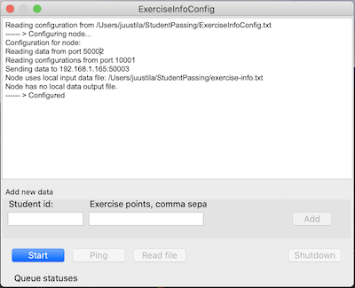

# StudentPassing


Software architectures course (OHAR) exercise work "StudentPassing" is an implementation of a distributed software architecture and various design patterns in C++17.

This project has been created for educational purposes and may have no other value to anyone.

## What is this repository for?

Anyone wishing to learn about software architectural patterns and design patterns, learning C++, creating and building own and using external libraries.

This repository produces a distributed GUI application, build on top of a specific "things". The applications enable handling of student passing data by several teachers, combining the various course points into a final grade.



*StudentPassing Node running and configured*

## Dependencies

In this project,  following components and tools are used:

Tools:

* A C++ compiler supporting C++ 17. GCC or clang are OK, for example. If you install a C++ IDE, you will get also a C++ compiler.
* [CMake](https://cmake.org) for building the system in different platforms and with different compilers.
* An IDE that CMake supports for viewing code ([Visual Studio](https://visualstudio.microsoft.com), [Eclipse for C/C++](https://www.eclipse.org/downloads/packages/release/2019-12/r/eclipse-ide-cc-developers), [Xcode](https://developer.apple.com/xcode/),...)

External components:

* [Boost](https://boost.org) 1.70.0 or newer for network programming and various other utilities from Boost.
* [nlohmann::json](https://github.com/nlohmann/json) for parsing and creating JSON.
* [g3logger](https://github.com/KjellKod/g3log) for logging events in all components of this software. Requires at least C++ v 14.
* [Qt](https://www.qt.io) for the GUI apps using the other components of the system.

Components related to StudentPassing, OHAR course exercise work system:

* [ProcessorNode](https://github.com/PipesAndFiltersProject/ProcessorNode), a library supporting development of distributed apps based on an architectural style we do not reveal here because educational purposes... ;) 
* [StudentNodeElements](https://github.com/PipesAndFiltersProject/StudentNodeElements), based on ProcessorNode, of which we do not talk more here, because of educational purposes.... ;) 
* and this component, the StudentPassing app, here.

The architecture of StudentPassing is based on the ProcessorNode component, using also domain specific layer StudentNodeElements build on top of ProcessorNode. For more details on these, see each component's documentation and code.

Instuctions on how to get started and build all the components are below.

## How do I get set up?

For the OHAR course project, you can view the code in GitHub using your browser, but it is *very* inconvenient. It is strongly recommended to download / git clone the projects to your own machine and view the code using an IDE (Visual Studio, Eclipse, or similar).

---
You can also use the [provided script](getAllComponents.sh) to download **all** needed libraries, including this project you are looking at here. So **copy this script file** to your machine, and then **run the script in some empty directory outside this or any other project directory**! Otherwise you will create a mess.

The script downloads Boost 1.72.0 as a zip file and git clones other libraries and project components from GitHub. wget and git must be installed to use this script.

Script should work also on Windows with wget and git, just rename it to .bat and execute it.

---

Alternatively, download / clone the components manually; URLs are available in the script file and linked in Dependencies.

After the files and repositories are on your machine you can either:

1. View the code by opening the source files as needed, *using an IDE*, or
2. Generate *IDE projects* from the components to view them in an organized way, 
3. and/or actually build the libraries and apps to see how the system works 

Step 1 is *recommended minimum* for all students, others are optional. You will learn a lot if you do 2-3.

## Building

For the course work, building is *optional*. 

Starting from Boost, building happens like this, assuming you use make for buiilding:

1. In the Boost directory you get when unzipping the downloaded zip file:
    * use `bootstrap.sh` (.bat in Windows) to set up Boost, then run `b2 cxxflags="-std=c++17"` to build boost (system library at least), then run again `b2 install` (may require admin / sudo rights) to install boost headers and lib(s).
    * For more information, see boost getting started guide for your OS.
2. Set up nlohmann::json using cmake in the json directory:
    * `mkdir build && cd build`, 
    * then `cmake ..` and 
    * finally install json: `sudo make install` to copy the headers to system include diretories. Obviously in Windows sudo is not sudo or may not be needed.   
3. Set up g3logger, which needs to be build and package made (make package)
    * again `mkdir build && cd build`,
    * then `cmake ..` and 
    * finally install g3logger: `sudo make install` -- this installs the headers and the library needed in linking to the component.
4. Do the same steps for ProcessorNode component and then 
5. StudentNodeElements component -- with similar cmake commands as above.
6. Finally build the executable in *this* repository project. This project uses all of the above so it must be build last.
    * The app has a GUI implemented in Qt, so you must install Qt (the Open Source version) before doing this final step. 
    * After you have installed Qt, you can build this GUI app. Note that you need to tell CMake from where the Qt libraries are found. In the build directory, do (after `mkdir build && cd build`):
    * `cmake -DCMAKE_PREFIX_PATH=/path/to/qt/directory/where/cmake ..`

For an example what the Qt path looks like, see the [script](createXcodeProject.sh) which creates an Xcode project of the GUI app.

After this you should have all setup for configuring (see below) and running the StudentPassing system.


## Generate IDE projects for convenient viewing

If you are using an IDE that supports CMake (like new Visual Studio), you may open all the projects with CMake build file (CMakeLists.txt) directly from Visual Studio. 

Note however, that you must build and install the components so that when component A requires component B, the B project must be built and installed first, only then you can use the A component (without VS complaining about errors). The above list of ordering is the correct one.

For IDEs that do not support opening CMake files as projects, you must generate the IDE project files from command line. For example, to generate project file for Xcode on macOS, do this:

```bash
mkdir xcode && cd xcode
cmake -GXcode ..
```
And for those components which use Qt, you also need to specify in cmake command, where Qt libraries' cmake files are to be found. Change the path to where Qt is installed in *your* machine.

```bash
cmake -GXcode -DCMAKE_PREFIX_PATH=/Users/juustila/Qt/5.12.1/clang_64/lib/cmake ..
```

If you do not have Xcode, you must specify the [IDE you are using](https://cmake.org/cmake/help/v3.0/manual/cmake-generators.7.html) by providing something else than Xcode as value in the -G option. 

## Running the system

If you managed to build and install all the components, you can also run them to see how they work. For this, check out the [FilesToInstall readme](./FilesToInstall/README.md), which explains how to configure and setup the configuration and data files needed to run the Nodes. There are four nodes configured there, for handling:

1. basic student data (id, name and study program):
2. exam points students got from the course exam;
3. exercise points, from one or several exercises, and;
4. course project points, after which the course grade can finally be calculated.

The Nodes use datafiles to read student data as a batch. You can generate random student data for testing reliability and performance using the [TestDataGenerator](TestDataGenerator) command line app. Just run it, adjusting the test data generation with command line parameters. After test data generation, you can copy the data files to the location instructed in the [FilesToInstall readme](./FilesToInstall/README.md).

## Who do I talk to? ##

Repo is owned and maintained by Antti Juustila (antti.juustila at oulu.fi)

## License ##

(c) Antti Juustila 2014-2020. This software is licensed in [GPL version 2 or later](https://opensource.org/licenses/gpl-2.0.php).

